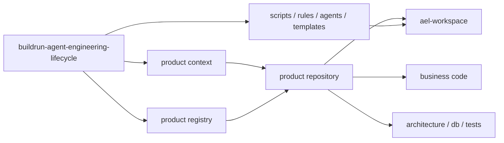
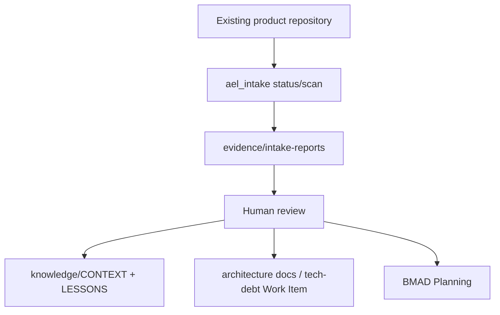
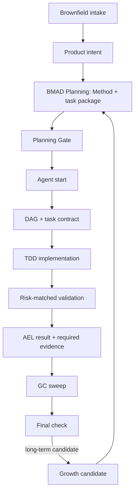

# BuildRun Agent Engineering Lifecycle Architecture

本文是 buildrun-agent-engineering-lifecycle 的架构入口。它描述系统边界、状态流、配置分工和质量门禁；完整文档地图见 [docs/index.md](docs/index.md)，当前操作见 [docs/getting-started/cli.md](docs/getting-started/cli.md)，精简执行目标见 [docs/design/lean-enforcement.md](docs/design/lean-enforcement.md)。

## 1. Architecture Intent

BuildRun Agent Engineering Lifecycle 是独立于具体产品仓库的产品研发生命周期工具。它不属于任意单一产品业务代码，也不应该被复制到每个产品里。

核心目标：

- 用一套 buildrun-agent-engineering-lifecycle 服务多个产品研发团队。
- 让每个产品仓库保留自己的配置、规格、任务、证据和长期知识。
- 把产品前导、Agent 执行、风险匹配验证、熵减和知识沉淀连成可审计闭环。
- 把关键约束固化为脚本和 CI 门禁，而不是只写在提示词里。
- 在统一执行面后保留参考项目中已验证的能力，不保留其命令数量和固定仪式；完整契约见 [docs/design/lean-enforcement.md §1.1](docs/design/lean-enforcement.md#11-能力保留契约)。

## 2. System Boundary



buildrun-agent-engineering-lifecycle owns:

- Agent role definitions.
- Quality gates and scripts.
- Task templates and workflow definitions.
- Work Item provider adapters.
- Product registry, session product context, and active-product fallback.
- Cross-product rules after human review.

Product repository owns:

- Business source code and tests.
- Product architecture documents.
- Product workspace configuration.
- Planning artifacts, task packages, runtime state, QA evidence, project knowledge.

## 3. Product Workspace

每个产品仓库通过 `ael-workspace/project.yaml` 声明自己的 workspace。默认结构：

```text
ael-workspace/
├── project.yaml
├── planning/
│   ├── product-specs/
│   ├── exec-plans/
│   └── tasks/
├── runs/
├── knowledge/
│   ├── CONTEXT.md
│   └── LESSONS.md
└── evidence/
    ├── summaries/
    ├── progress/
    ├── test-reports/
    ├── review-reports/
    ├── intake-reports/
    └── growth-reports/
```

`planning/` 是产品设计和任务前导资产目录，不是研发阶段目录。产品目录使用稳定资产语义：planning、runs、knowledge、evidence；历史文档中的 `Phase 0` 对应现在的 **BMAD Planning**。

## 4. State And Truth Sources

| 状态/配置 | 真相源 | 说明 |
|-----------|--------|------|
| buildrun-agent-engineering-lifecycle 管理哪些产品 | `.ael/products/registry.yaml` | 本机产品台账，本地生成且 gitignored |
| 当前命令作用于哪个产品 | `--product-root/--product-id`、`AEL_PRODUCT_ROOT/AEL_PRODUCT_ID`、cwd discovery、`.ael/products/active-product.json` | active product 只是本机默认兜底 |
| 产品 workspace 如何组织 | `<product-root>/ael-workspace/project.yaml` | 产品侧配置 |
| AEL 必备文件 | `.ael/ael-manifest.yaml` | 自检清单 |
| 任务规格与计划 | `<product-root>/ael-workspace/planning/` | 产品记录系统 |
| 运行凭证与 active task | `<product-root>/ael-workspace/runs/` | 本地运行状态 |
| 目标任务状态 | `<product-root>/ael-workspace/runs/tasks/<task-id>/result.json` | 本地物化快照，不作为接受端可盲信凭证 |
| 目标合并/发布准入 | 受控 Git 接收端对 `refs/harness/attestations/<commit>` 和 canonical result object 的重验结果 | attestation 只是输入索引；接收端逐 commit 重算 tier、scope、policy 与机械 code-health，后续由受控端签发 acceptance receipt |
| 接入/测试/审查/成长证据 | `<product-root>/ael-workspace/evidence/` | 可回放证据 |
| 长期产品知识 | `<product-root>/ael-workspace/knowledge/` | 不依赖聊天记忆 |

buildrun-agent-engineering-lifecycle `.ael/config.yaml` 只提供默认值和兼容字段，不是产品接入真相源。开源源码只保留 `.ael/products/*.example.*`，不提交带本机绝对路径的产品台账。

任务结果在读取和原子写入时执行同一 schema 校验。`status` 会重算 worktree subject 与 policy digest；任一变化都会把 `validated` 退回 `active`、标记旧 checks 为 stale，并要求下一次 `finish` 重新判定，不能靠复制旧 `result.json` 保持有效完成态。

## 5. Brownfield Intake Flow

已有项目接入是 BMAD Planning 之前的事实建档步骤。它读取产品仓库既有代码、文档、测试、CI 与技术栈信号，生成产品侧 INTAKE 报告，再由人类 review 后迁入产品知识系统。



不变式：

- INTAKE 报告属于产品侧证据，不属于 buildrun-agent-engineering-lifecycle runtime。
- INTAKE 报告不是长期知识，不能自动进入 `CONTEXT.md` / `LESSONS.md`。
- 老项目事实必须经过人工 review 后，再进入 BMAD Planning 和后续 Agent 执行上下文。

完整说明见 [docs/getting-started/brownfield-intake.md](docs/getting-started/brownfield-intake.md)。

## 6. Execution Flow



主要不变式：

- 没有产品前导凭证，不启动执行闭环。
- 已有项目接入报告未经 review，不能当成长期知识。
- 没有任务契约，不调度实现 Agent。
- 没有与 execution tier 匹配的验证和有效生命周期结果，不允许任务完成；独立 QA 与 TEST/REVIEW 证据由 `standard` / `strict` 要求触发。
- 没有结构守门和计划同步，不允许合并。
- 没有人工 review 和 `ael_growth.sh apply-review`，成长候选不能进入产品知识；没有跨产品 review，不能升级成全局规则。

BuildRun Agent Engineering Lifecycle 使用两个正交分层：`lite|standard|strict` 决定任务验证深度，`local|guarded|enforced` 决定接受保障。core 只依赖 Git：`local` 生成任务结果；`guarded` 由 `post-commit` 生成 attestation 并用 repo-local hooks 验证；`enforced` 由受控 bare Git 的 `pre-receive` 逐 commit 重验并阻断，`post-receive` 为实际已接受 commit 签发 receipt，provider 终态只消费有效 receipt。框架 fixture 的端到端能力已验证；单个产品只有其实际 authority 的安装审计通过后才可标记 enforced。代码托管和 CI 不参与 BuildRun Agent Engineering Lifecycle 的生命周期事实。

## 7. Gate Chain

| 门禁 | 保护的问题 |
|------|------------|
| Lifecycle validate | runtime 文件和 manifest 完整 |
| Intake scan | 已有项目事实形成可 review 证据 |
| Planning Gate | BMAD Planning 产物和任务包真实存在 |
| Task contract check | 实现任务有 read/write/action/verify/done |
| DAG sync check | `tasks-dag.md` 与实施方案一致 |
| Structure guard | 变更路径符合 profile 边界 |
| Plan sync check | diff 中的路径已进入实施方案 |
| QA sign-off | execution tier 要求独立 QA 时，保证 QA 与实现者职责隔离 |
| QA evidence check | execution tier 要求时，校验签章、TEST 和 REVIEW 证据 |
| Growth review check | 存在长期候选时，保证 GROWTH 报告经过 review 后才可 apply |
| Quality commands | 产品侧 lint/test 命令真实执行，严格模式下缺配置即 block |
| Doc gardening | 文档链接、旧路径和信息架构约束 |
| Final check | 发布前完整链路 |
| Code health | `finish` 始终执行 diff 机械扫描，并按 tier/信号要求独立 gc-sweeper；receive authority 只接受同一 SSH trust root 验证且重算绑定一致的 GC receipt |
| Commit acceptance | `finish` 生成 validated result；`post-commit` 绑定 commit/tree，并原子创建 attestation ref 与 canonical result-object ref；两者只是 Git 对象可达性索引，不是平行任务状态 |
| Enforcement audit | 验证目标 remote/ref 或发布入口安装接收端 verifier、强制逐 commit 重验，并持有独立签名私钥 |
| Provider lifecycle | 本地最多 ready/review；终态校验受控接受点签名且未过期的 acceptance receipt，签名信任根支持多公钥轮换 |

## 8. Progressive Disclosure

入口职责必须保持分层：

- `README.md`：开源读者入口，讲价值、快速开始和核心概念。
- `AGENTS.md`：Agent 地图，只指路不展开流程。
- `ARCHITECTURE.md`：架构入口，讲边界、状态和门禁。
- `CLAUDE.md`：Claude 适配层，只写工具差异和硬约束。
- `docs/getting-started/cli.md`：公开使用模型与当前兼容命令参考。
- `docs/getting-started/brownfield-intake.md`：已有项目接入的定位、流程、报告与 review 规则。
- `.ael/README.md`：runtime 内部脚本索引。

这条分层本身由 doc-gardening 维护，避免入口文档重新长成百科。

## 9. Extension Model

迁移到新产品时，不修改 buildrun-agent-engineering-lifecycle 闭环主体，只替换：

- product registry entry。
- 产品 `ael-workspace/project.yaml`。
- profile 参考资料和 `.ael/profiles/<profile>/package-allowlist.yaml`。
- 必要的领域 prompt 或规则。
- Work Item provider 配置。

产品经验先落在产品 workspace。只有在多个产品中重复成立，并经人工 review，才迁入 buildrun-agent-engineering-lifecycle rules、templates 或 docs。

参考项目能力也遵循同一扩展原则：优先复用现有 gate、目录语义和 adapter；新增公开入口前必须证明现有 `plan/start/status/finish` 无法承载。低风险 `lite` 可由 `start` 生成最小绑定，不能据此跳过 `standard/strict` 的规划凭证。
