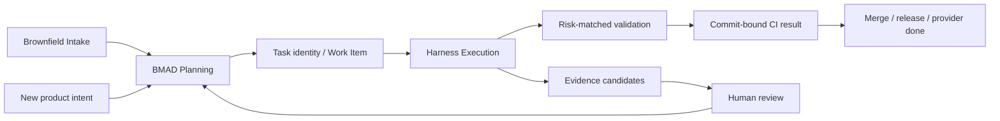

# Team Product R&D Harness 全景手册

> 文档定位：解释 Team Product R&D Harness 的设计背景、系统模型、能力来源和演进边界。本文不维护命令、provider 配置、实时成熟度或技术债状态。
>
> 当前使用以 [USAGE.md](./USAGE.md) 为准；精简执行目标以 [lean-enforcement.md](./design-docs/lean-enforcement.md) 为准；当前成熟度以 [Harness_成熟度评估.md](./Harness_成熟度评估.md) 为准。

## 1. 为什么需要 Harness

AI Agent 参与产品研发时，常见失控不是“不会写代码”，而是缺少完整工程环境：

| 失控模式 | 结果 | Harness 对策 |
|----------|------|--------------|
| 没有形成可测试规格就实现 | 做错需求、反复返工 | BMAD Planning + Planning Gate |
| 计划、代码和协同任务彼此脱节 | 范围漂移、状态失真 | 任务身份 + Work Item adapter + scope gate |
| Agent 自己实现、自己宣布通过 | 自证合格 | 风险要求时独立 QA 或人工 Gate |
| 所有任务执行最长流程 | Token、上下文和时间固定税过高 | planning level + execution tier |
| 经验只停留在对话 | 下一次重复踩坑 | 产品知识与候选 review 闭环 |
| 规范只写在说明中 | Agent 遗漏后仍能合并 | CLI、状态和 CI 机械强制 |

Harness 的目标不是增加流程，而是让必要流程无法遗漏，让不必要流程不再发生。

## 2. 核心模型

Team Product R&D Harness 把研发组织为一个事实前导和两个闭环：

1. **事实前导**：已有项目先通过 Intake 识别代码、架构、测试、CI 和上游边界；全新项目直接进入产品规划。
2. **产品闭环**：BMAD Planning 回答“做什么、为什么、如何验收”，再同步必要的协同信息。
3. **执行闭环**：Harness Execution 回答“由谁改、改哪里、如何验证、什么结果允许交付”。
4. **知识闭环**：执行证据只形成候选；长期有效内容经 review 后进入产品知识或跨产品规则。

最高原则是：

> 没有与当前变更匹配的 Harness 合规结果，任务不能进入有效完成态；Harness 对合规结果零妥协，对执行成本持续最小化。

## 3. 分层与所有权

### 3.1 Harness runtime

`harness-engineering/` 负责：

- Agent 角色、通用规则和任务模板。
- 质量、安全、结构、证据和协同 adapter。
- 多产品台账与产品上下文解析。
- 跨产品成立且经 review 的通用经验。

它不保存任何单一产品的 PRD、任务实例、QA 报告或长期知识。

### 3.2 Product workspace

产品仓库拥有自己的 `harness-workspace/`：

| 目录 | 责任 |
|------|------|
| `project.yaml` | 产品接入配置、profile、provider、质量命令 |
| `planning/` | 产品规格、执行计划、任务绑定与任务包 |
| `runs/` | 本地 active task、baseline、凭证与目标 `result.json` |
| `knowledge/` | CONTEXT、LESSONS、REFERENCE_SYSTEMS |
| `evidence/` | 按需生成的 INTAKE、TEST、REVIEW、SUMMARY、PROGRESS、GROWTH |

产品业务代码、架构、数据库和测试仍属于产品仓库本身，不属于 workspace。

### 3.3 真相源

| 事实 | 权威来源 |
|------|----------|
| Harness 管理哪些产品 | 本机 `.harness/products/registry.yaml` |
| 当前终端作用于哪个产品 | 显式参数或 session context；active product 仅兜底 |
| 产品 workspace 如何组织 | 产品 `harness-workspace/project.yaml` |
| 产品规格和任务范围 | 产品 `harness-workspace/planning/` |
| 本地任务状态 | 目标 `runs/tasks/<task-id>/result.json` |
| 某个 commit 是否允许接收/发布 | 受控 Git authority 对 attestation/result refs 和目标 commit 的重验结果；客户端 attestation 不能单独决定接受 |
| 产品长期知识 | 产品 `harness-workspace/knowledge/` |

本地 `finish pass` 只代表可以进入 review，不能直接关闭外部 Work Item。

## 4. 两种分层不能混用

### Planning level

L1/L2/L3 来自 planning level 模型，用来决定规格和任务包复杂度：

| Level | 规划含义 |
|-------|----------|
| L1 | 小范围、低联动，使用最小规格或 Quick Flow |
| L2 | 单模块多文件或核心逻辑，需要方案和任务契约 |
| L3 | 跨模块、契约、数据或复杂影响，需要完整分析和任务包 |

L1/L2/L3 不是执行风险等级。模板中的历史 `风险等级` 只是当前脚本兼容镜像，语义仍是 planning level。

### Execution tier

`lite/standard/strict` 根据计划、产品 policy 和实际 diff 决定验证深度：

| Tier | 执行含义 |
|------|----------|
| `lite` | 共同不变式 + 增量验证，不承担完整 QA/报告固定税 |
| `standard` | 普通功能默认层级，增加独立审查和测试证据 |
| `strict` | 安全、权限、数据、生产副作用等高风险，增加完整 QA、人工或部署证据 |

初始 tier 只能作为下限；最终 tier 必须根据实际变更重算，任务生命周期内只能升级。无法可靠分类时使用 `standard`，不能为了成本自行降级。

## 5. 四个共同不变式

任何 execution tier 都必须证明：

1. 正式迭代绑定了唯一、可追踪的 Harness Task ID。
2. 实际变更没有越过产品、profile 和任务范围。
3. 已运行与实际风险匹配的验证。
4. 本地结果、目标 commit attestation 和受控接受点签名都有效，才能发布或关闭外部 Work Item。

独立 QA、TEST/REVIEW、浏览器 QA、GC 和人工 Gate 是可保留的能力，但不是所有任务固定步骤。需要时必须执行，不需要时不得生成空证据模拟合规。

## 6. 角色边界

| 角色 | 责任 | 不允许 |
|------|------|--------|
| planning-agent | 规格、影响、方案、任务建档 | 写业务代码 |
| lead-agent | 拆任务、调度、维护范围与结果 | 亲自实现业务代码 |
| backend/frontend-agent | TDD 实现和可执行验证 | 签署被要求的独立 QA |
| qa-evaluator | 风险要求时独立测试、审查和签章 | 修改业务逻辑帮助通过 |
| gc-sweeper | 风险要求时清理熵和调试残留 | 借清理新增功能 |

角色分离保护的是验收可信度。`lite` 不要求独立 QA 时，仍必须有机械验证和有效结果；这不等于实现 Agent 可以伪造 QA 身份。

## 7. 参考项目能力保留

Harness 的能力来自多个成熟项目和方法，但这些来源不形成需要逐套执行的并行工作流：

| 来源 | 保留内容 | 不保留内容 |
|------|----------|------------|
| OpenAI Harness Engineering | 短地图、渐进披露、仓库记录、机械反馈、文档园艺 | 把所有实现细节暴露给 Agent |
| BMAD Method | Analysis、Planning、Solutioning、可测试验收和实现就绪 | 所有任务固定运行完整方法链 |
| Flow-X | 产品知识、恢复记录、测试/审查/成长证据语义 | 每任务固定生成所有报告 |
| Superpowers | 规格先行、TDD、系统调试和完成前验证 | 与 Harness 重复的第二套入口 |
| GStack | 真实环境调查、浏览器 QA 和审查视角 | 所有任务固定浏览器取证 |
| planning level | planning level、任务模板和 Entry Gate | 用 L1/L2/L3 代替执行风险 |
| Ralph / Agent Review | Agent 审 Agent和失败修复 | 不受预算和风险约束的循环 |
| Brownfield Intake | 已有项目事实扫描和 review 后入知识 | 每次迭代重新全仓扫描 |
| Work Item provider | 负责人、状态、讨论和生命周期 | 把完整规格复制到外部系统 |

完整的来源到内部权威映射只在 [references/index.md](./references/index.md) 维护。

## 8. Profile 隔离

通用 Harness 不写死产品目录、语言或领域模型。active profile 可以提供：

- package allowlist 和 protected 路径。
- 产品架构不变式和领域参考。
- 特定质量命令或附加 gate。

Agent 的通用代码放置规则始终先解析产品 `project.yaml` 和 active profile。产品专用目录、上游边界和领域规则只属于对应产品 profile，不能成为 generic 默认值。

新增 profile 不得增加新的核心动作或创建独立完成态；它只能向统一 `plan/start/status/finish` 提供识别、上下文和附加风险信号。

## 9. 知识和证据

### 候选不是知识

- Intake 报告记录已有项目事实候选。
- PROGRESS 只用于需要跨会话恢复的中断任务。
- TEST/REVIEW 由 execution tier 或人工阅读需要触发。
- Growth 只在发现跨任务失败模式、架构边界、新默认行为或技术债候选时触发。
- SUMMARY 只在恢复、交接或人类阅读需要时生成。

候选必须经过人工或明确授权的 review，才能迁入 CONTEXT、LESSONS、REFERENCE_SYSTEMS、产品架构或跨产品规则。Token、secret、完整 prompt 和大段命令输出不进入长期知识。

### 成本属于正确性

目标结果统一记录实现成本与 Harness 固定开销，包括 Token、上下文字符数、Agent 调用、gate 耗时和重跑。无法精确获得的数据写 `unknown`，不能用 `0` 伪装完整遥测，也不能另建一套成本 Markdown 报告。

## 10. 强制执行边界

仅靠文档和提示词无法保证遵循。目标实现有四层控制：

1. **导航层**：Agent 只看到正确入口和最小规则。
2. **CLI 层**：`plan/start/status/finish` 是唯一正常操作面；其中 `status` 只读。
3. **状态层**：输入变化会使旧验证结果失效；确定性 gate 只在 fingerprint 相同时复用。
4. **接受层**：Git hooks、受控 remote `pre-receive` 或发布入口调用同一 commit verifier。

任务验证深度使用 `lite|standard|strict`，接受保障使用 `local|guarded|enforced`。只有受控 Git remote 的 `pre-receive` 或发布入口强制运行 verifier，且 provider 终态由 authority service 使用固定 TrustPolicy、对应 acceptance receipt 与机械关闭顺序执行时，才能标记 `enforced`；普通本地 close 永远不能进入终态。`local` 与 `guarded` 在旧 schema 中仍映射为 `shadow`，不能宣称流程不可绕过。

## 11. 历史数据升级

升级策略是：

> 历史数据原位可读，新任务写新格式；只迁移继续执行所必需的最小状态。

- 已完成任务、历史 evidence 和产品知识不批量迁移。
- 进行中或重开的任务补 Harness Task ID、execution tier、baseline 和初始 `result.json`。
- 旧 Planning Gate、QA 凭证和 Work Item ID 继续兼容读取。
- 缺失历史 baseline 时记录 migration baseline，并至少执行一次完整 `standard` 验证。
- 迁移不移动、不删除、不批量改写 `planning/`、`knowledge/` 或 `evidence/`。

完整规则见 [lean-enforcement.md §10](./design-docs/lean-enforcement.md#10-历史数据与兼容升级)。

## 12. 文档所有权

| 主题 | 权威文档 |
|------|----------|
| 使用模型与当前命令 | [USAGE.md](./USAGE.md) |
| 精简强制执行目标 | [lean-enforcement.md](./design-docs/lean-enforcement.md) |
| 系统边界与真相源 | [ARCHITECTURE.md](../ARCHITECTURE.md) |
| 通用产品模型 | [Team_Product_Harness.md](./Team_Product_Harness.md) |
| product workspace | [Harness_Product_Workspace.md](./Harness_Product_Workspace.md) |
| BMAD Planning | [BMAD_Prelude.md](./BMAD_Prelude.md) |
| 多人协作 | [COLLABORATION.md](./COLLABORATION.md) |
| 当前成熟度和优先级 | [Harness_成熟度评估.md](./Harness_成熟度评估.md) |
| 技术债状态 | [tech-debt-tracker.md](./exec-plans/tech-debt-tracker.md) |
| 外部能力来源 | [references/index.md](./references/index.md) |

本文只解释这些主题如何组成一个系统，不复制它们的命令、配置或实时状态。
