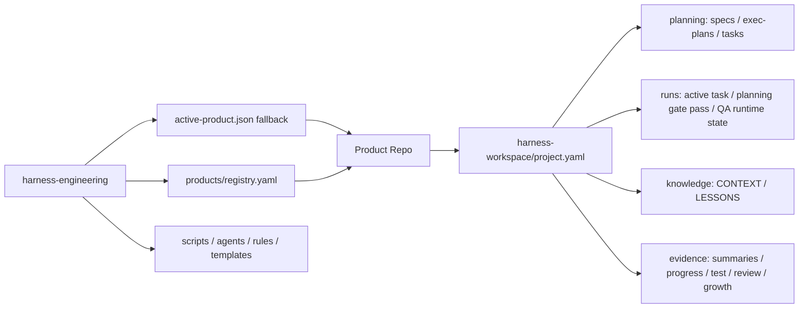

# Workspace 分层与所有权

> 日期：2026-06-20
> 结论：Agent Engineering Lifecycle 已从 embedded harness 调整为 **harness-engineering + product-owned workspace**。`harness-engineering/` 是高于具体产品的生命周期 runtime；每个产品仓库保存自己的配置、规划产物、运行状态、知识与证据。
> **精简升级边界**：目录职责、知识语义、证据语义和历史审计链继续保留；新产物改为按 planning level、execution tier、任务恢复或长期候选按需生成，不再把每个目录都解释为每个任务必须写一份文件。

## 1. 设计目标

Agent Engineering Lifecycle 不是某个产品仓库里的脚手架，而是一套可服务 1..N 个软件产品研发团队的生命周期工具。

它应该回答五个问题：

| 问题 | 归属 |
|------|------|
| Harness 的流程、脚本、Agent、门禁在哪里？ | harness-engineering `harness-engineering/` |
| 当前要服务哪个产品？ | 显式/session 产品上下文；`.harness/products/active-product.json` 只是默认兜底 |
| Harness 管理过哪些产品？ | harness-engineering 本地 `.harness/products/registry.yaml` |
| 某个产品的产物、知识、证据放哪里？ | product `<product-root>/harness-workspace/project.yaml` |
| 单次任务的规格、计划、验证、成长证据在哪里沉淀？ | product `<product-root>/harness-workspace/` |

## 2. 总体架构



关键原则：

- harness-engineering 可以放在任意路径，不要求和产品仓库同级。
- 产品仓库不复制 harness-engineering runtime。
- 历史文档中的 `Phase 0` 对应现在的 **BMAD Planning**，不再作为产品 workspace 的顶级目录名。
- 产品侧目录使用更稳定的业务语义：`planning/`、`runs/`、`knowledge/`、`evidence/`。
- harness-engineering 的新脚本使用 `workspace_paths.py`；`phase0_paths.py` 仅作为兼容 API，避免一次性破坏现有门禁。

## 3. 目录职责

### 3.1 harness-engineering

```text
harness-engineering/
├── README.md
├── AGENTS.md
├── docs/
├── tasks/_templates/
└── .harness/
    ├── agents/
    ├── products/
    │   ├── README.md
    │   ├── registry.example.yaml
    │   ├── active-product.example.json
    │   ├── registry.yaml              # 本机生成，gitignored
    │   └── active-product.json        # 本机生成，gitignored
    ├── rules/
    ├── scripts/
    ├── templates/
    ├── workflows/
    └── work-items/
```

harness-engineering 保存可复用能力：

- Agent 角色定义
- 质量门禁脚本
- 任务模板
- Work Item provider
- profile 级参考资料
- 本机产品台账与 active product fallback（gitignored）

harness-engineering 不保存某个产品的 PRD、任务包、测试报告、成长报告。

### 3.2 product workspace

```text
<product-root>/harness-workspace/
├── project.yaml
├── planning/
│   ├── product-specs/
│   ├── exec-plans/
│   └── tasks/
├── runs/
├── knowledge/
│   ├── CONTEXT.md
│   └── LESSONS.md
└── evidence/
    ├── summaries/
    ├── progress/
    ├── test-reports/
    ├── review-reports/
    ├── intake-reports/
    └── growth-reports/
```

product workspace 保存产品私有内容：

- 产品级 Harness 配置
- BMAD Planning 规划产物
- 单次任务包
- active task 与运行状态
- 沙箱执行、浏览器 QA 的本地运行证据（如 `runs/browser-qa/`）
- 产品知识库
- 已有项目接入、测试、审查、成长证据

这些内容随着产品演进，不随着 harness-engineering 复制或全量迁移。升级 runtime 时历史 planning、knowledge 和 evidence 原位可读；仅进行中或重开任务补齐继续执行所需的最小状态，详见 [精简强制执行设计 §10](../design/lean-enforcement.md#10-历史数据与兼容升级)。

## 4. 为什么不用 `phase0/` 做顶级目录

`phase0` 是流程阶段，不是稳定的信息架构。顶级目录如果叫 `phase0`，会带来三个问题：

1. 它把“阶段名”和“资产类型”混在一起，后续 Lifecycle Execution、QA、Growth 证据不好归位。
2. 它暗示产物只属于某个阶段，而 `tasks/`、`evidence/`、`knowledge/` 会跨阶段被持续读取。
3. 它让产品仓库结构难以被非 Harness 用户理解。

因此新的产品 workspace 使用：

| 新目录 | 含义 | 是否跨阶段 |
|--------|------|------------|
| `planning/` | 产品规格、执行计划、任务包 | 是 |
| `runs/` | 当前运行状态、active task、临时凭证 | 是 |
| `knowledge/` | 长期产品记忆：BMAD 规划、已有项目接入、成长沉淀 | 是 |
| `evidence/` | 接入、测试、审查、摘要、成长报告 | 是 |

历史 `Phase 0` 术语统一映射为：BMAD Method 前导 → Planning Gate → Lifecycle Execution。

## 5. 启动与绑定

首次接入产品：

```bash
cd /path/to/harness-engineering

bash .harness/scripts/harness_init.sh init \
  --product-root /path/to/product \
  --product-id product-id \
  --product-name "Product Name" \
  --profile generic \
  --install-bmad
```

这个步骤会做四件事：

1. 在 harness-engineering 本机产品台账登记产品。
2. 写入本机 active product fallback，作为单产品默认上下文。
3. 在产品根创建 `harness-workspace/` 标准目录。
4. 写入产品侧 `harness-workspace/project.yaml`。
5. 带 `--install-bmad` 时，在产品根非交互安装 BMAD；默认模块 `bmm,tea`、默认工具 `codex,cursor`，并要求生成 `_bmad/` 才算成功。原生输出会标准化到 `bmad-output/{planning-artifacts,design-artifacts,implementation-artifacts,test-artifacts}/`。

设置默认产品：

```bash
bash .harness/scripts/harness_init.sh use --product-id product-id
bash .harness/scripts/harness_init.sh list
```

`use` 不适合作为多产品并行的上下文切换机制；它会改变同一个 harness-engineering 下所有未显式指定产品的终端。并行研发时应使用 session 级上下文：

```bash
eval "$(bash .harness/scripts/harness_product.sh env --product-id product-a)"
bash .harness/scripts/check.sh
```

或一次性执行：

```bash
bash .harness/scripts/harness_product.sh exec --product-id product-b -- bash .harness/scripts/agent_start.sh <work-item-id>
```

脚本解析产品根的优先级：

1. `--product-root` / `--product-id`
2. `HARNESS_PRODUCT_ROOT` / `HARNESS_PRODUCT_ID`（兼容 `PRODUCT_ROOT`）
3. 当前工作目录向上发现产品侧 `harness-workspace/project.yaml`
4. `.harness/products/active-product.json`
5. `.product-root`
6. 历史向上搜索兼容

## 6. 台账与产品配置的分工

### harness-engineering 产品台账

`.harness/products/registry.yaml` 解决“harness-engineering 在本机管哪些产品”。它可能包含本机绝对路径，因此不应提交；开源仓库只提交 `.harness/products/registry.example.yaml`：

```yaml
products:
  - id: my-product
    name: My Product
    profile: generic
    root: /path/to/product
    workspace: harness-workspace
    config: harness-workspace/project.yaml
    bmad_install_root: .
    bmad_output_root: harness-workspace/bmad-output
```

适合放在 registry 的信息：

- 产品 ID
- 产品名
- 产品根路径
- workspace 名称
- 默认 profile
- BMAD 安装与输出根
- 当前 harness-engineering 需要定位产品所需的最小元数据

### product project.yaml

`<product-root>/harness-workspace/project.yaml` 解决“这个产品怎么组织自己的 Harness 产物”：

```yaml
product:
  id: my-product
  name: My Product
  profile: generic

workspace:
  root: harness-workspace
  planning: planning
  runs: runs
  knowledge: knowledge
  evidence: evidence

planning:
  product_specs: product-specs
  exec_plans_active: exec-plans/active
  exec_plans_completed: exec-plans/completed
  tasks: tasks

runs:
  agent_workspace: .

knowledge:
  context_file: CONTEXT.md
  lessons_file: LESSONS.md

evidence:
  summaries_dir: summaries
  progress_dir: progress
  test_reports_dir: test-reports
  review_reports_dir: review-reports
  growth_reports_dir: growth-reports
  intake_reports_dir: intake-reports

harness:
  task_contract: harness-task-v1

bmad:
  install_root: .
  output_root: harness-workspace/bmad-output
  normalized_planning_root: harness-workspace/planning
```

适合放在 `project.yaml` 的信息：

- 产品 workspace 内部结构
- planning / runs / knowledge / evidence 的相对路径
- 任务契约版本
- BMAD 在该产品内的输出路径

不放在 `project.yaml` 的信息：

- harness-engineering 脚本路径
- harness-engineering 管理的其它产品
- 跨产品通用规则
- 其它产品的知识或证据

## 7. BMAD 安装与输出路径

BMAD 是产品前导方法，不属于 harness-engineering runtime。

推荐分工：

| 项 | 位置 |
|----|------|
| BMAD 安装根 | 产品根，生成 `_bmad/` |
| BMAD 原生输出 | `harness-workspace/bmad-output/{planning-artifacts,design-artifacts,implementation-artifacts,test-artifacts}/` |
| BMAD 正式映射产物 | `harness-workspace/planning/` |
| Planning Gate | harness-engineering `.harness/scripts/planning_gate.sh`（`bmad_entry_gate.sh` 为兼容入口） |
| BMAD 规划沉淀 | `harness_knowledge.sh sync-planning` → `harness-workspace/knowledge/CONTEXT.md` |
| Lifecycle Execution 启动 | harness-engineering `.harness/scripts/agent_start.sh` |

初始化脚本会在 `_bmad/` 存在后写入 `_bmad/custom/config.toml`，将 BMAD 原生输出校准到 `harness-workspace/bmad-output/`，并标准化创建 `planning-artifacts/`、`design-artifacts/`、`implementation-artifacts/`、`test-artifacts/`。`design-artifacts/` 会同时配置为 `modules.bmm.design_artifacts` 与 `modules.cis.design_artifacts`。需要自动安装时显式加参数；安装完成但未生成 `_bmad/` 时必须 `block`：

```bash
bash .harness/scripts/harness_init.sh init \
  --product-root /path/to/product \
  --product-id product-id \
  --product-name "Product Name" \
  --install-bmad
```

全新项目不需要先做 Brownfield Intake。BMAD Planning 产出的产品目标、产品蓝图、架构/执行计划和任务边界进入 `planning/` 后，由 `planning_gate.sh` 自动触发 `harness_knowledge.sh sync-planning`，同步为 `knowledge/CONTEXT.md` 的长期上下文。

## 8. 已有项目接入、知识沉淀与自我成长

Agent Engineering Lifecycle 的成长能力属于产品 workspace，而不是 lifecycle runtime 自动吞掉所有经验。

已有项目接入闭环如下：

1. `harness_init.sh init` 创建产品侧 workspace。
2. `harness_intake.sh scan` 扫描既有代码、关键入口、文档、测试、技术栈和模块边界。
3. 报告写入 `evidence/intake-reports/<date>-INTAKE.md`。
4. 人类 review 接入报告。
5. 长期稳定事实进入 `knowledge/CONTEXT.md`、`knowledge/LESSONS.md`、产品架构文档或技术债 Work Item。

完整说明见 [getting-started/brownfield-intake.md](../getting-started/brownfield-intake.md)。

任务后的自我成长闭环如下：

1. 执行任务时产出 summary、progress、test、review 证据。
2. `harness_growth.sh scan` 从证据中提取成长候选。
3. 人类 review 成长报告，并用 `harness_growth.sh review-status` 确认无待处理项。
4. `harness_growth.sh apply-review` 把 `context/architecture` 类确认项写入 `knowledge/CONTEXT.md`，把 `lesson/tech-debt` 类确认项写入 `knowledge/LESSONS.md`。
5. 架构文档、技术债 Work Item 或跨产品 harness 规则仍由负责人按 review 结论单独迁移。

这个设计避免两种风险：

- harness-engineering 被某个产品的临时经验污染。
- AI 自动修改全局规则导致规则漂移。

## 9. 迁移状态

> 下一代精简执行的完整兼容策略见 [design/lean-enforcement.md §10](../design/lean-enforcement.md#10-历史数据与兼容升级)。升级原则是历史数据原位可读、新任务写新格式，仅对进行中或重开的任务补最小运行状态。

已完成：

- harness-engineering `harness-engineering/` 与具体产品仓库解耦。
- 产品侧 `harness-workspace/project.yaml` 成为 workspace 配置真相源。
- 产品侧目录从 `phase0/` 调整为 `planning/`、`runs/`、`knowledge/`、`evidence/`。
- 本机产品台账与 session/active fallback 产品上下文已落地。
- `workspace_paths.py` 是语义化路径入口；`phase0_paths.py` 支持读取新 schema 并保留兼容字段。
- `harness_init.sh` 支持 `init`、`use`、`list`。

保留兼容：

- 部分 JSON 字段仍保留 `phase0_*`，仅用于兼容旧门禁 API。
- `phase0_pass.json` 作为历史兼容副本保留；新准入凭证是 `planning_gate_pass.json`。
- 新执行模型落地后继续兼容读取旧 Planning Gate、QA 凭证和 evidence；不要求已完成任务补造 `result.json`。
- 产品的 planning、knowledge、evidence 和外部 Work Item ID 原位保留，禁止因 runtime 升级批量重写或重新编号。

后续优化：

- 提供只读 `harness workspace audit`，识别新格式、legacy 已完成、活动待迁移和缺失凭证任务。
- 新 `lite` 任务只生成可提交的 `planning/tasks/<task-id>/task.json` 作为 CI 绑定，不生成完整 00–06 任务包；历史任务不补造该文件。
- 提供面向活动任务的 `harness migrate-task <task-id>`；历史 L2/L3 的 `task-id` 可沿用外部 Work Item ID。缺少可靠旧 baseline 时记录 `baseline_source: migration`、废弃旧缓存并至少执行 `standard` 完整验证，不伪造历史状态。
- 继续减少文档和新脚本中对历史 `phase0` 名称的直接暴露。
- QA evidence、TEST/REVIEW 报告完整性已接入 `check.sh`；后续增强报告语义校验。
- 增加第二个 Work Item provider 验证通用性。
- 在已支持 Docker backend 与 Playwright setup/CI 的基础上，继续增强 Firecracker/远程隔离执行器与复杂浏览器交互脚本库。
