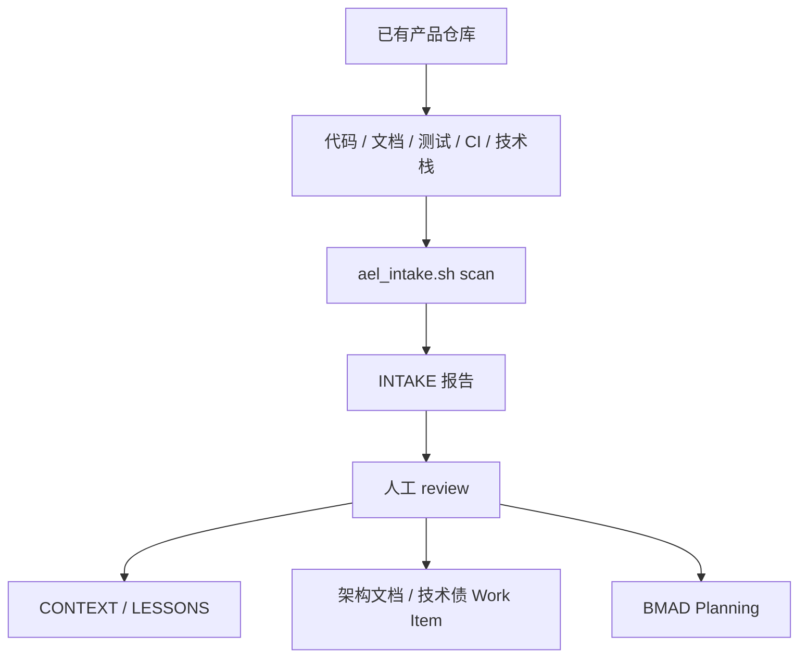

# 已有项目接入（Brownfield Intake）

> 本文是 BuildRun Agent Engineering Lifecycle 支持已有产品项目的权威说明。操作细节见 [getting-started/cli.md](./cli.md)，产品 workspace 结构见 [architecture/workspace.md](../architecture/workspace.md)。
> Intake 能力在精简方案中继续保留，但只在首次接入、上游版本显著变化或项目事实漂移时运行，不进入每个任务的固定路径。

## 1. 定位

已有项目接入是 **BMAD Planning 之前的事实建档步骤**。它解决的问题不是“立刻让 Agent 写代码”，而是先让 AEL 对产品仓库的既有代码、文档、测试、技术栈和模块边界形成可 review 的事实视图。

它适用于：

- 已经有代码和架构文档的产品仓库。
- 需要把历史文档、服务目录、测试与 CI 纳入 AEL 体系的团队。
- 需要从“聊天记忆/个人经验”迁移到 `ael-workspace/knowledge/` 的产品。
- 需要让后续 BMAD Planning 和 Agent 执行建立在真实项目上下文上的场景。
- 需要长期复用 DeerFlow、OpenViking 等重度依赖，不希望每次任务都重新解读上游代码的场景。

它不做：

- 不自动改写产品代码。
- 不自动修改 `CONTEXT.md` / `LESSONS.md`。
- 不自动修改 buildrun-agent-engineering-lifecycle 全局规则。
- 不把扫描报告直接当成长期知识。

## 2. 设计原则

| 原则 | 含义 |
|------|------|
| 事实优先 | 先列出已有文档、代码目录、技术栈、测试与 CI 信号 |
| 入口优先 | 对代码不只数文件，还提名 agent、factory、middleware、service、retriever、router 等关键入口 |
| 候选而非结论 | 报告只输出候选项，是否沉淀由人 review |
| 产品侧归属 | 报告保存在产品仓库 `ael-workspace/evidence/intake-reports/` |
| 不污染 runtime | buildrun-agent-engineering-lifecycle 不保存某个产品的接入报告 |
| 安全默认 | 跳过 `.env`、依赖缓存、BMAD 输出、AEL workspace 与本地 Agent 缓存 |
| 可重复 | 可以多次扫描，报告作为产品接入历史证据保留 |

## 3. 信息流



## 4. 产物位置

```text
<product-root>/ael-workspace/
├── project.yaml
├── knowledge/
│   ├── CONTEXT.md
│   ├── LESSONS.md
│   └── REFERENCE_SYSTEMS.md
└── evidence/
    └── intake-reports/
        └── YYYY-MM-DD-INTAKE.md
```

`intake-reports/` 是证据目录，不是长期知识目录。长期稳定内容必须先由人或 Agent review；review 通过后运行 `ael_intake.sh apply-review`，由 AEL 把受管区块写入 `knowledge/CONTEXT.md`、`knowledge/LESSONS.md` 与 `knowledge/REFERENCE_SYSTEMS.md`，不需要人工复制粘贴。

需要注意：`apply-review` 写入的是证据索引和候选入口，不会凭空完成语义理解。对 DeerFlow、OpenViking 这类重度依赖，Agent/架构负责人必须基于报告中的“关键代码入口候选”深读源码和文档，再把核心逻辑、主流程、扩展点、禁改边界写入 `REFERENCE_SYSTEMS.md` 的人工维护区。产品架构文档和 Work Item 仍由负责人确认后再落地。

## 5. 操作步骤

以下命令是当前实现入口；目标状态由产品接入或 `start` 的事实新鲜度检查按需调用，不要求日常任务重复执行。

在 buildrun-agent-engineering-lifecycle 根目录执行：

```bash
eval "$(bash .ael/scripts/ael_product.sh env --product-id <product-id>)"
bash .ael/scripts/ael_knowledge.sh ensure
bash .ael/scripts/ael_intake.sh status
bash .ael/scripts/ael_intake.sh scan
bash .ael/scripts/ael_intake.sh review-status
bash .ael/scripts/ael_intake.sh apply-review
```

可选指定产品根：

```bash
AEL_PRODUCT_ROOT=/path/to/product \
bash .ael/scripts/ael_intake.sh scan
```

`ael_init.sh use --product-id <product-id>` 仍可设置默认 fallback；多产品并行时优先使用 `ael_product.sh env` 或 `AEL_PRODUCT_ROOT/AEL_PRODUCT_ID`，避免不同终端互相切换默认产品。

典型输出：

```json
{"decision":"pass","reason":"INTAKE_REPORT_READY: ael-workspace/evidence/intake-reports/2026-06-20-INTAKE.md"}
```

## 6. 报告内容

INTAKE 报告包含：

- 产品身份、扫描时间、产品根与 workspace。
- 顶层目录与文件清单。
- 已有文档清单与标题摘要。
- 模块目录，例如 `services/`、`apps/`、`packages/`。
- 关键代码入口候选，例如 Agent factory、middleware、service core、retriever、router、MCP server。
- 技术栈信号，例如 `package.json`、`requirements.txt`、`Dockerfile`、CI 配置。
- 测试与构建信号。
- `CONTEXT` 候选：产品目标、领域术语、运行方式、服务边界。
- `LESSONS` / 技术债候选：需要人工判断的 TODO、FIXME、临时方案、失败测试等线索。
- `## 0. Review 工作台`：置顶的可勾选处理项与 review 结论记录表。
- 第 6 节人工 review 说明：指向第 0 节，避免 checklist 被报告内容淹没。

## 7. Review 规则

| 候选类型 | 迁入位置 | 判定标准 |
|----------|----------|----------|
| 稳定产品事实 | `knowledge/CONTEXT.md` | 后续任务会反复用到，且半年内大概率仍成立 |
| 重复失败经验 | `knowledge/LESSONS.md` | 不记录会再次返工或踩坑 |
| 上游/重度依赖系统 | `knowledge/REFERENCE_SYSTEMS.md` | DeerFlow、OpenViking 等会被频繁依赖，需深读关键代码入口并沉淀核心逻辑、扩展点、代码入口和禁改边界 |
| 架构边界 | 产品 `architecture/` 或架构索引 | 涉及服务职责、数据流、接口契约、部署边界 |
| 技术债 | Work Item provider | 需要排期、负责人和验收标准 |
| 一次性噪音 | 留在 INTAKE 报告 | 证据不足、历史残留、已被现有知识覆盖 |

### 7.1 归属策略

如果产品仓库里混有上游官方代码、vendor 代码、fork 代码和自研代码，必须先在产品侧 `ael-workspace/project.yaml` 配置 `intake.scopes`。Intake 会按**最长路径优先**匹配，因此可以表达“整个 `deer-flow/` 是上游参考，但 `deer-flow/mobile/` 是本产品 iOS App”。

```yaml
intake:
  default_scope:
    role: product-owned
    review: full
    debt: track
    description: "默认按产品自有内容处理。"
  scopes:
    - path: deer-flow/mobile
      role: product-owned
      review: full
      debt: track
      description: "本产品 iOS App，需要 review 产品技术债、测试和架构边界。"
    - path: deer-flow
      role: upstream-reference
      review: core-logic-and-features
      debt: ignore
      description: "上游官方代码，只理解核心逻辑和可复用特性，不追踪上游技术债。"
    - path: OpenViking
      role: upstream-reference
      review: core-logic-and-features
      debt: ignore
      description: "上游官方代码，只理解核心逻辑和可复用特性，不追踪上游技术债。"
```

推荐语义：

| 角色 | Review 策略 | 技术债策略 |
|------|-------------|------------|
| `product-owned` | `full` | `track` |
| `upstream-reference` | `core-logic-and-features` | `ignore` |
| `vendor` | `interfaces-and-constraints` | `ignore` |
| `generated` | `ignore` | `ignore` |

## 8. 与 BMAD Planning 的关系

已有项目接入不替代 BMAD Planning。正确顺序是：

1. `ael_init.sh init/use` 绑定产品。
2. `ael_intake.sh scan` 生成已有项目事实报告。
3. 人工或 Agent review 报告 `## 0. Review 工作台（先处理）`，并深读关键代码入口，完成长期知识摘要。
4. 用 `ael_intake.sh review-status` 确认可处理项，再运行 `ael_intake.sh apply-review` 自动沉淀受管证据区块到产品知识系统。
5. 进入 BMAD Planning，创建规格、执行计划与任务包。
6. 通过 Entry Gate 后进入 Lifecycle Execution。

这样做的好处是：BMAD 和 Agent 后续读取到的是经过 review 的项目知识，而不是未经筛选的扫描噪音。

## 9. 安全与排除范围

扫描默认排除：

- `ael-workspace/` 与 `ael-workspace*` 备份。
- `_bmad/`、`_bmad-output/`、`bmad-output/`。
- `.env`、`.env.*`、私钥/证书类文件。
- `node_modules/`、`.venv/`、`__pycache__/`、构建产物和缓存。
- `.agent/`、`.agents/`、`.claude/`、`.cursor/`、`.trae/` 等本地 Agent 缓存。

报告会对疑似密钥值做脱敏，但安全边界仍应以前置排除和人工 review 为准。不要把 INTAKE 报告当成密钥审计工具。

## 10. 成熟度边界

当前能力已经适合产品接入试运行：

- 能稳定生成产品侧报告。
- 能识别已有文档、代码、测试、CI 与技术栈信号。
- 能提名关键代码入口，支持对重度依赖做深读沉淀。
- 能把候选知识纳入人工 review 流程。

仍需增强：

- 更强的语义级架构提名。
- 更细的服务依赖图和调用关系分析。
- 与 Work Item provider 联动创建技术债候选任务。
- 多次 intake report 的差异对比。
